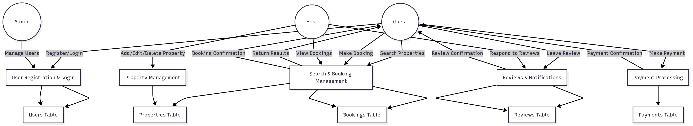

# Airbnb Clone Data Flow Diagram

## 📚 Overview
This diagram illustrates the **flow of data within the Airbnb Clone backend system**.  
It focuses on how data moves between key entities and core backend processes.

The diagram was created using **Mermaid Chart (mermaidchart.com)** and exported as a PNG file.

---

## 🔹 Data Description
The data flow covers the following core backend operations:

- **User Data:** Registration, login credentials, profile information stored in the Users table.  
- **Property Data:** Property listings, details, and availability stored in the Properties table.  
- **Booking Data:** Guest bookings, status updates, and cancellations stored in the Bookings table.  
- **Payment Data:** Payment transactions and confirmations stored in the Payments table.  
- **Review Data:** Guest reviews and host responses stored in the Reviews table.  

---

## 🔹 Key Entities
1. **Guest** – Browses properties, makes bookings, leaves reviews, and makes payments.  
2. **Host** – Adds, edits, and deletes property listings; views bookings; responds to reviews.  
3. **Admin** – Manages users, properties, bookings, and payments across the system.  
4. **System / Backend** – Processes all requests, validates bookings, handles payments, stores data, and sends notifications.  

---

