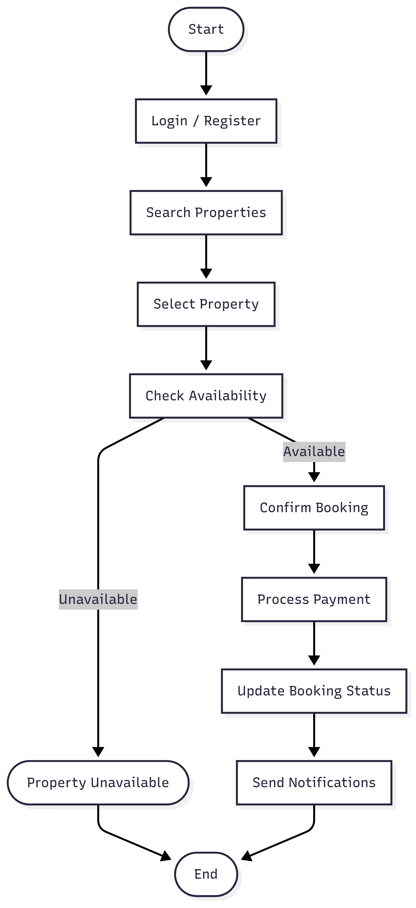

# Airbnb Clone Booking Process Flowchart

## 📚 Overview
This flowchart illustrates the **workflow of the Guest Booking process** in the Airbnb Clone backend.  
It maps the steps from user login to property selection, booking confirmation, payment processing, and notifications.

The flowchart was created using **Mermaid Chart (mermaidchart.com)** and exported as a PNG file.

---

## 🔹 Key Steps in the Booking Process
1. **Start** – Guest initiates the booking process.  
2. **Login / Register** – Guest authenticates or creates an account.  
3. **Search Properties** – Guest searches properties using filters such as location, price, number of guests, and amenities.  
4. **Select Property** – Guest chooses a property from search results.  
5. **Check Availability** – System validates the selected dates.  
   - If unavailable, the guest is notified and the process ends.  
6. **Confirm Booking** – Guest confirms the booking.  
7. **Process Payment** – Payment is handled securely via Stripe or PayPal.  
8. **Update Booking Status** – System updates the booking as confirmed.  
9. **Send Notifications** – Confirmation notifications are sent to both Guest and Host.  
10. **End** – Booking process completed.

---

