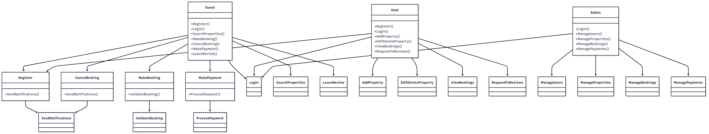

# Airbnb Clone Use Case Diagram

## 📚 Overview
This diagram visualizes the **interactions between users and the Airbnb Clone backend system**.  
It was created using **Mermaid Chart (mermaidchart.com)** and exported as a PNG file.

The use case diagram shows the major **actors** (Guest, Host, Admin) and their **interactions** with the system for key functionalities like registration, property booking, payments, and notifications.

---

## 🔑 Actors
1. **Guest** – A user looking to browse and book properties.  
2. **Host** – A user who lists and manages properties.  
3. **Admin** – Manages users, listings, bookings, and payments.  
4. **System** – The backend that processes all user requests and handles notifications and validations.

---

## 🔹 Key Use Cases
- **Guest:** Register, Login, Search Properties, Make Booking, Cancel Booking, Make Payment, Leave Review  
- **Host:** Register, Login, Add Property, Edit/Delete Property, View Bookings, Respond to Reviews  
- **Admin:** Login, Manage Users, Manage Properties, Manage Bookings, Manage Payments  
- **System:** Send Notifications, Process Payments, Validate Bookings, Store Data

---

